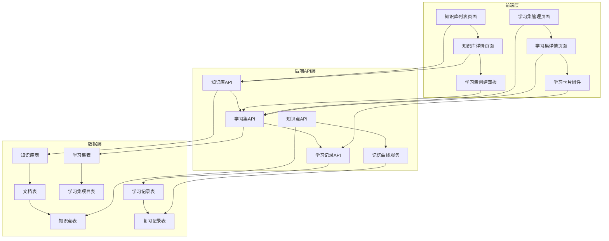

# 设计文档

## 概述

本设计文档描述了将现有问题管理系统重构为以知识库为中心的学习系统的技术方案。系统将支持知识点提问功能、学习集管理和基于记忆曲线的学习体验。

## 架构

### 系统架构图



## 组件和接口

### 1. 数据模型扩展

#### 知识点模型扩展
```python
class KnowledgePoint(Base):
    # 现有字段...
    question = Column(Text)  # 新增：基于知识点内容生成的问题
```

#### 新增学习集模型
```python
class LearningSet(Base):
    __tablename__ = "learning_sets"
    
    id = Column(Integer, primary_key=True)
    user_id = Column(Integer, ForeignKey("users.id"))
    knowledge_base_id = Column(Integer, ForeignKey("knowledge_bases.id"))
    name = Column(String(200), nullable=False)
    description = Column(Text)
    created_at = Column(DateTime(timezone=True), server_default=func.now())
    
    # 关系
    user = relationship("User")
    knowledge_base = relationship("KnowledgeBase")
    learning_items = relationship("LearningSetItem", cascade="all, delete-orphan")

class LearningSetItem(Base):
    __tablename__ = "learning_set_items"
    
    id = Column(Integer, primary_key=True)
    learning_set_id = Column(Integer, ForeignKey("learning_sets.id"))
    knowledge_point_id = Column(Integer, ForeignKey("knowledge_points.id"))
    added_at = Column(DateTime(timezone=True), server_default=func.now())
    
    # 关系
    learning_set = relationship("LearningSet")
    knowledge_point = relationship("KnowledgePoint")

class LearningRecord(Base):
    __tablename__ = "learning_records"
    
    id = Column(Integer, primary_key=True)
    user_id = Column(Integer, ForeignKey("users.id"))
    knowledge_point_id = Column(Integer, ForeignKey("knowledge_points.id"))
    learning_set_id = Column(Integer, ForeignKey("learning_sets.id"))
    
    # 记忆曲线相关字段
    mastery_level = Column(Integer, default=0)  # 0: 不会, 1: 学习中, 2: 已学会
    review_count = Column(Integer, default=0)
    last_reviewed = Column(DateTime(timezone=True))
    next_review = Column(DateTime(timezone=True))
    ease_factor = Column(Float, default=2.5)
    interval_days = Column(Integer, default=1)
    
    created_at = Column(DateTime(timezone=True), server_default=func.now())
    updated_at = Column(DateTime(timezone=True), onupdate=func.now())
    
    # 关系
    user = relationship("User")
    knowledge_point = relationship("KnowledgePoint")
    learning_set = relationship("LearningSet")
```

### 2. 后端API设计

#### 知识库统计API
```python
# GET /api/knowledge-bases/{id}/statistics
{
    "knowledge_base_id": 1,
    "total_documents": 5,
    "total_knowledge_points": 45,
    "documents": [
        {
            "id": 1,
            "filename": "document1.pdf",
            "knowledge_point_count": 12
        }
    ]
}
```

#### 学习集管理API
```python
# POST /api/learning-sets
{
    "name": "Python基础学习",
    "description": "Python编程基础知识点学习集",
    "knowledge_base_id": 1,
    "document_ids": [1, 2, 3]  # 选中的文档ID列表
}

# GET /api/learning-sets
{
    "learning_sets": [
        {
            "id": 1,
            "name": "Python基础学习",
            "description": "...",
            "knowledge_base_id": 1,
            "knowledge_base_name": "编程学习",
            "total_items": 25,
            "mastered_items": 8,
            "learning_items": 12,
            "new_items": 5,
            "created_at": "2024-01-01T00:00:00Z"
        }
    ]
}

# GET /api/learning-sets/{id}/items
{
    "learning_set_id": 1,
    "items": [
        {
            "id": 1,
            "knowledge_point": {
                "id": 1,
                "title": "变量定义",
                "content": "...",
                "question": "如何在Python中定义变量？",
                "importance_level": 3
            },
            "mastery_level": 1,
            "next_review": "2024-01-02T10:00:00Z",
            "review_count": 2
        }
    ]
}
```

#### 学习记录API
```python
# POST /api/learning-records
{
    "knowledge_point_id": 1,
    "learning_set_id": 1,
    "mastery_level": 1  # 0: 不会, 1: 学习中, 2: 已学会
}

# GET /api/learning-sets/{id}/due-reviews
{
    "due_items": [
        {
            "knowledge_point_id": 1,
            "title": "变量定义",
            "question": "如何在Python中定义变量？",
            "content": "...",
            "next_review": "2024-01-01T10:00:00Z"
        }
    ]
}
```

### 3. 前端组件设计

#### 知识库统计组件
```typescript
interface KnowledgeBaseStats {
  total_documents: number;
  total_knowledge_points: number;
  documents: Array<{
    id: number;
    filename: string;
    knowledge_point_count: number;
  }>;
}

const KnowledgeBaseStatsCard: React.FC<{stats: KnowledgeBaseStats}> = ({stats}) => {
  // 显示知识库统计信息
};
```

#### 学习集创建面板
```typescript
interface LearningSetCreatePanelProps {
  knowledgeBaseId: number;
  documents: Document[];
  onCreateLearningSet: (data: LearningSetCreateData) => void;
}

const LearningSetCreatePanel: React.FC<LearningSetCreatePanelProps> = ({
  knowledgeBaseId,
  documents,
  onCreateLearningSet
}) => {
  // 多选文档，创建学习集
};
```

#### 学习卡片组件
```typescript
interface LearningCardProps {
  knowledgePoint: KnowledgePointWithQuestion;
  onAnswer: (masteryLevel: 0 | 1 | 2) => void;
}

const LearningCard: React.FC<LearningCardProps> = ({knowledgePoint, onAnswer}) => {
  const [showContent, setShowContent] = useState(false);
  
  // 显示问题 -> 用户思考 -> 显示内容 -> 选择熟练程度
};
```

## 数据模型

### 知识点扩展格式
```
标题：认知调整的关键
提问：如何调整认知？
内容：通过识别偏见和二元对立思维，逐步接纳自我复杂性。例如，戒烟时意识到"想抽烟"的本能与"想戒烟"的意愿并存，需灵活应对。
重要性：3
```

### 记忆曲线算法
基于SuperMemo SM-2算法：
- 初始间隔：1天
- 质量评分：0(不会) -> 1天，1(学习中) -> 根据ease_factor计算，2(已学会) -> 增加间隔
- ease_factor调整：根据用户表现动态调整

## 错误处理

### API错误处理
- 400: 请求参数错误
- 401: 未授权访问
- 404: 资源不存在
- 500: 服务器内部错误

### 前端错误处理
- 网络错误：显示重试按钮
- 数据加载失败：显示错误提示
- 用户操作错误：表单验证提示

## 测试策略

### 单元测试
- 记忆曲线算法测试
- 知识点解析测试
- API接口测试

### 集成测试
- 学习集创建流程测试
- 学习卡片交互测试
- 数据同步测试

### 端到端测试
- 完整学习流程测试
- 多用户并发测试
- 数据一致性测试