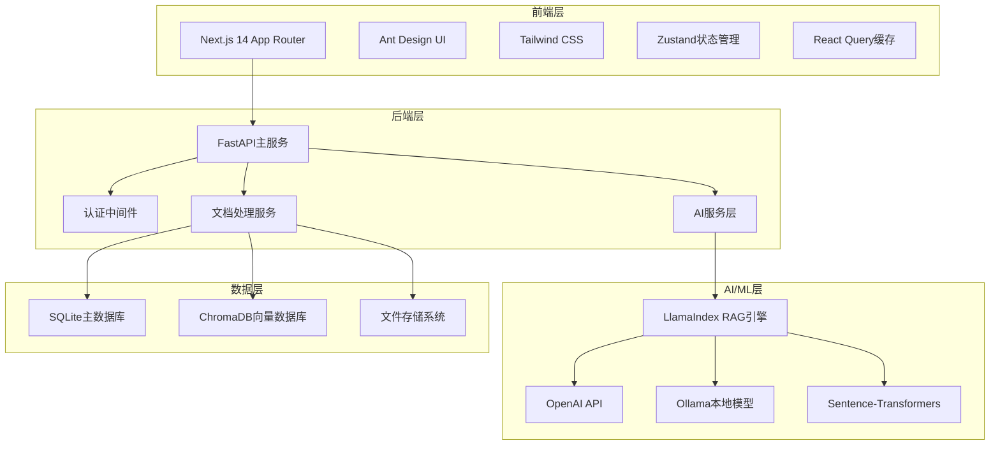
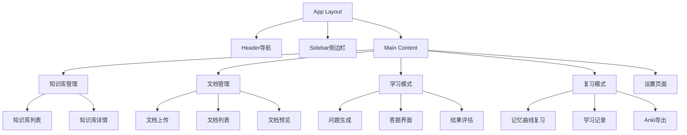

# 设计文档

## 概述

基于RAG的学习平台采用前后端分离架构，前端使用Next.js 14构建现代化Web应用，后端使用FastAPI提供高性能API服务。系统核心围绕LlamaIndex构建RAG能力，结合ChromaDB进行向量存储，支持多种大模型接入，为用户提供智能化的文档学习体验。

## 架构

### 系统架构图



### 技术栈分层

**前端技术栈：**
- **框架：** Next.js 14 with App Router - 提供SSR/SSG能力和现代化开发体验
- **UI组件：** Ant Design - 企业级组件库，适合管理系统界面
- **样式：** Tailwind CSS - 实用优先的CSS框架，用于自定义样式
- **状态管理：** Zustand - 轻量级状态管理
- **服务器状态：** React Query - 缓存和同步服务器状态
- **表单处理：** React Hook Form + Zod - 高性能表单验证

**后端技术栈：**
- **主框架：** FastAPI - 高性能异步Web框架
- **AI集成：** LlamaIndex - RAG应用核心框架
- **模型接入：** OpenAI SDK + Ollama Python库
- **嵌入模型：** Sentence-Transformers
- **主数据库：** SQLite - 轻量级关系数据库
- **向量数据库：** ChromaDB - 文档向量存储和检索
- **认证：** JWT (PyJWT) - 无状态认证
- **Anki导出：** Genanki - 生成Anki卡片包

## 组件和接口

### 前端组件架构



### 后端API接口设计

**认证相关：**
```
POST /api/auth/login - 用户登录
POST /api/auth/register - 用户注册
POST /api/auth/refresh - 刷新token
```

**知识库管理：**
```
GET /api/knowledge-bases - 获取知识库列表
POST /api/knowledge-bases - 创建知识库
GET /api/knowledge-bases/{id} - 获取知识库详情
PUT /api/knowledge-bases/{id} - 更新知识库
DELETE /api/knowledge-bases/{id} - 删除知识库
```

**文档管理：**
```
POST /api/documents/upload - 上传文档
GET /api/documents - 获取文档列表
GET /api/documents/{id} - 获取文档详情
DELETE /api/documents/{id} - 删除文档
POST /api/documents/{id}/process - 处理文档（向量化）
```

**学习功能：**
```
POST /api/learning/generate-questions - 生成问题
POST /api/learning/submit-answer - 提交答案
GET /api/learning/questions/{id} - 获取问题详情
POST /api/learning/evaluate-answer - 评估答案
```

**知识点管理：**
```
GET /api/knowledge-points - 获取知识点列表
POST /api/knowledge-points/extract - 提取知识点
PUT /api/knowledge-points/{id} - 更新知识点
```

**复习系统：**
```
GET /api/review/due - 获取待复习内容
POST /api/review/complete - 完成复习
GET /api/review/statistics - 获取学习统计
```

**导出功能：**
```
POST /api/export/anki - 导出Anki卡片包
GET /api/export/anki/{id}/download - 下载Anki文件
```

## 数据模型

### SQLite数据库设计

```sql
-- 用户表
CREATE TABLE users (
    id INTEGER PRIMARY KEY AUTOINCREMENT,
    username VARCHAR(50) UNIQUE NOT NULL,
    email VARCHAR(100) UNIQUE NOT NULL,
    password_hash VARCHAR(255) NOT NULL,
    created_at TIMESTAMP DEFAULT CURRENT_TIMESTAMP,
    updated_at TIMESTAMP DEFAULT CURRENT_TIMESTAMP
);

-- 知识库表
CREATE TABLE knowledge_bases (
    id INTEGER PRIMARY KEY AUTOINCREMENT,
    user_id INTEGER NOT NULL,
    name VARCHAR(100) NOT NULL,
    description TEXT,
    created_at TIMESTAMP DEFAULT CURRENT_TIMESTAMP,
    updated_at TIMESTAMP DEFAULT CURRENT_TIMESTAMP,
    FOREIGN KEY (user_id) REFERENCES users(id)
);

-- 文档表
CREATE TABLE documents (
    id INTEGER PRIMARY KEY AUTOINCREMENT,
    knowledge_base_id INTEGER NOT NULL,
    filename VARCHAR(255) NOT NULL,
    file_path VARCHAR(500) NOT NULL,
    file_type VARCHAR(10) NOT NULL,
    file_size INTEGER NOT NULL,
    processed BOOLEAN DEFAULT FALSE,
    created_at TIMESTAMP DEFAULT CURRENT_TIMESTAMP,
    FOREIGN KEY (knowledge_base_id) REFERENCES knowledge_bases(id)
);

-- 问题表
CREATE TABLE questions (
    id INTEGER PRIMARY KEY AUTOINCREMENT,
    document_id INTEGER NOT NULL,
    question_text TEXT NOT NULL,
    context TEXT,
    difficulty_level INTEGER DEFAULT 1,
    created_at TIMESTAMP DEFAULT CURRENT_TIMESTAMP,
    FOREIGN KEY (document_id) REFERENCES documents(id)
);

-- 答案记录表
CREATE TABLE answer_records (
    id INTEGER PRIMARY KEY AUTOINCREMENT,
    user_id INTEGER NOT NULL,
    question_id INTEGER NOT NULL,
    user_answer TEXT NOT NULL,
    reference_answer TEXT,
    score FLOAT,
    feedback TEXT,
    answered_at TIMESTAMP DEFAULT CURRENT_TIMESTAMP,
    FOREIGN KEY (user_id) REFERENCES users(id),
    FOREIGN KEY (question_id) REFERENCES questions(id)
);

-- 知识点表
CREATE TABLE knowledge_points (
    id INTEGER PRIMARY KEY AUTOINCREMENT,
    document_id INTEGER NOT NULL,
    title VARCHAR(200) NOT NULL,
    content TEXT NOT NULL,
    importance_level INTEGER DEFAULT 1,
    created_at TIMESTAMP DEFAULT CURRENT_TIMESTAMP,
    FOREIGN KEY (document_id) REFERENCES documents(id)
);

-- 复习记录表
CREATE TABLE review_records (
    id INTEGER PRIMARY KEY AUTOINCREMENT,
    user_id INTEGER NOT NULL,
    content_id INTEGER NOT NULL,
    content_type VARCHAR(20) NOT NULL, -- 'question' or 'knowledge_point'
    review_count INTEGER DEFAULT 0,
    last_reviewed TIMESTAMP,
    next_review TIMESTAMP,
    ease_factor FLOAT DEFAULT 2.5,
    interval_days INTEGER DEFAULT 1,
    FOREIGN KEY (user_id) REFERENCES users(id)
);
```

### ChromaDB向量存储设计

```python
# 文档向量集合
document_collection = {
    "name": "documents",
    "metadata": {
        "document_id": "int",
        "knowledge_base_id": "int", 
        "chunk_index": "int",
        "file_type": "string"
    },
    "documents": ["文档分块内容"],
    "embeddings": [[向量数据]],
    "ids": ["doc_id_chunk_index"]
}

# 知识点向量集合
knowledge_point_collection = {
    "name": "knowledge_points",
    "metadata": {
        "knowledge_point_id": "int",
        "document_id": "int",
        "importance_level": "int"
    },
    "documents": ["知识点内容"],
    "embeddings": [[向量数据]],
    "ids": ["kp_id"]
}
```

## 错误处理

### 错误分类和处理策略

**1. 文档处理错误：**
- 文件格式不支持：返回400错误，提示支持的格式
- 文件过大：返回413错误，提示文件大小限制
- 文档解析失败：返回422错误，记录错误日志

**2. AI模型错误：**
- API调用失败：实现重试机制，最多重试3次
- 本地模型不可用：自动切换到备用模型或API模式
- 生成内容质量低：实现内容质量检查和重新生成

**3. 数据库错误：**
- 连接失败：实现连接池和自动重连
- 数据完整性错误：事务回滚和数据修复
- 查询超时：优化查询和添加索引

**4. 认证授权错误：**
- Token过期：自动刷新或重定向登录
- 权限不足：返回403错误和清晰的权限说明
- 用户不存在：返回404错误

### 全局错误处理中间件

```python
@app.exception_handler(Exception)
async def global_exception_handler(request: Request, exc: Exception):
    logger.error(f"Unhandled exception: {exc}", exc_info=True)
    return JSONResponse(
        status_code=500,
        content={
            "error": "Internal server error",
            "message": "An unexpected error occurred",
            "request_id": str(uuid.uuid4())
        }
    )
```

## 测试策略

### 测试金字塔

**单元测试（70%）：**
- 数据模型验证
- 业务逻辑函数
- 工具函数和辅助方法
- API端点的核心逻辑

**集成测试（20%）：**
- 数据库操作
- 外部API调用
- 文档处理流程
- AI模型集成

**端到端测试（10%）：**
- 完整的用户学习流程
- 文档上传到问题生成
- 答案评估到记录保存
- Anki导出功能

### 测试工具和框架

**后端测试：**
- pytest - Python测试框架
- pytest-asyncio - 异步测试支持
- httpx - HTTP客户端测试
- pytest-mock - Mock对象

**前端测试：**
- Jest - JavaScript测试框架
- React Testing Library - React组件测试
- Cypress - 端到端测试
- MSW - API Mock服务

### 性能测试

**负载测试场景：**
- 并发文档上传处理
- 大量问题生成请求
- 向量数据库查询性能
- 用户会话管理
